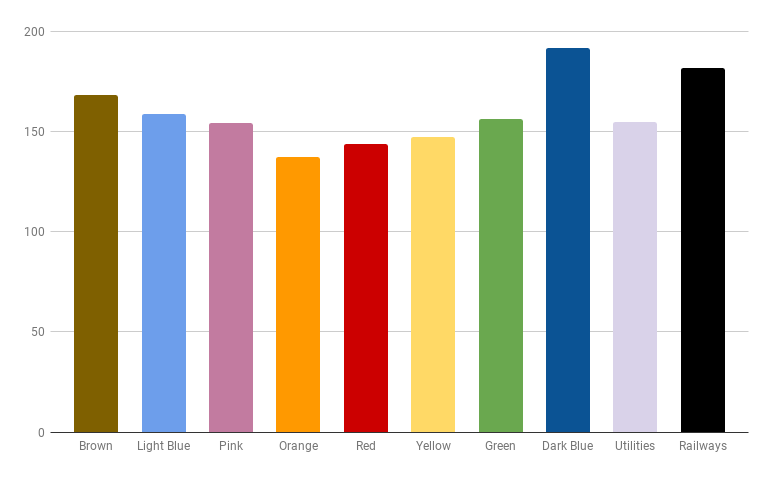

While browsing through YouTube, I came across this video discussing how Monopoly doesn't have the same likelihood for each position with some being more likely than others. I decided to take up this as a task for myself and attempt a simulation of the game. What followed was a couple of hours of coding, plotting and preparing the summary of my results. This was one of the most fun tasks I have ever done for all the while, I had my Monopoly board open on the side, periodically providing me with whiffs of nostalgia and childhood excitement. 

I ran the simulation code for a million games of a typical length and using these, obtained the probability distribution of the different properties in the game and the value for money of each property group. While I will not give all the details in this post *(you'll have to see the repository's README for that)*, I will leave you with this interesting graph that I obtained which shows the value for money of different property groups. 

For a detailed analysis with more graphs and methodology/formulation used to obtain these results, [check out the repository here](https://github.com/c-thun/Monopoly-Simulation/)
